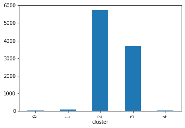

>> # Projeto de Clusterização de Municípios 

>> # Ralisson Araujo Ribeiro


Objetivo: 


- Classificar os municípios brasileiros com base nas informações disponíveis 
- Caracterize os grupos de municípios criado da melhor maneira possível. 

- Quais grupos de municípios deveriam ser a porta de entrada para empresa no país? Por quê?

- Elaborar um modelo de classificação para o cálculo da probabilidade de um determinado município pertencer a um dos grupos criados.


> # <font color='blue'> Etapa de clusterização dos municípios</font>

#### Importando dataset e pacotes necessários a análise


```python
import pandas as pd
import numpy as np
import matplotlib.pyplot as plt
from matplotlib import pylab
import seaborn as sns
from sklearn.cluster import KMeans
from sklearn.metrics import homogeneity_completeness_v_measure
from sklearn.decomposition import PCA
from sklearn.model_selection import train_test_split
from scipy.spatial.distance import cdist, pdist
from sklearn.metrics import silhouette_score
import warnings
warnings.filterwarnings("ignore")
%matplotlib inline
```


```python
pip install dash
```

    Requirement already satisfied: dash in d:\program_files\anaconda3\lib\site-packages (1.17.0)
    Requirement already satisfied: future in d:\program_files\anaconda3\lib\site-packages (from dash) (0.18.2)
    Requirement already satisfied: dash-core-components==1.13.0 in d:\program_files\anaconda3\lib\site-packages (from dash) (1.13.0)
    Requirement already satisfied: dash-html-components==1.1.1 in d:\program_files\anaconda3\lib\site-packages (from dash) (1.1.1)
    Requirement already satisfied: Flask>=1.0.2 in d:\program_files\anaconda3\lib\site-packages (from dash) (1.1.1)
    Requirement already satisfied: plotly in d:\program_files\anaconda3\lib\site-packages (from dash) (4.12.0)
    Requirement already satisfied: dash-renderer==1.8.3 in d:\program_files\anaconda3\lib\site-packages (from dash) (1.8.3)
    Requirement already satisfied: dash-table==4.11.0 in d:\program_files\anaconda3\lib\site-packages (from dash) (4.11.0)
    Requirement already satisfied: flask-compress in d:\program_files\anaconda3\lib\site-packages (from dash) (1.8.0)
    Requirement already satisfied: itsdangerous>=0.24 in d:\program_files\anaconda3\lib\site-packages (from Flask>=1.0.2->dash) (1.1.0)
    Requirement already satisfied: Jinja2>=2.10.1 in d:\program_files\anaconda3\lib\site-packages (from Flask>=1.0.2->dash) (2.11.1)
    Requirement already satisfied: Werkzeug>=0.15 in d:\program_files\anaconda3\lib\site-packages (from Flask>=1.0.2->dash) (1.0.0)
    Requirement already satisfied: click>=5.1 in d:\program_files\anaconda3\lib\site-packages (from Flask>=1.0.2->dash) (7.0)
    Requirement already satisfied: six in d:\program_files\anaconda3\lib\site-packages (from plotly->dash) (1.14.0)
    Requirement already satisfied: retrying>=1.3.3 in d:\program_files\anaconda3\lib\site-packages (from plotly->dash) (1.3.3)
    Requirement already satisfied: brotli in d:\program_files\anaconda3\lib\site-packages (from flask-compress->dash) (1.0.9)
    Requirement already satisfied: MarkupSafe>=0.23 in d:\program_files\anaconda3\lib\site-packages (from Jinja2>=2.10.1->Flask>=1.0.2->dash) (1.1.1)
    Note: you may need to restart the kernel to use updated packages.
    


```python
import dash
import dash_core_components as dcc
import dash_html_components as html
import plotly.graph_objects as go
```


```python

```


```python
# Carrega o dataset
dados = pd.read_csv('base.csv', delimiter=";", decimal=",")
dados.tail(5)
```


<div>
<style scoped>
    .dataframe tbody tr th:only-of-type {
        vertical-align: middle;
    }

    .dataframe tbody tr th {
        vertical-align: top;
    }

    .dataframe thead th {
        text-align: right;
    }
</style>
<table border="1" class="dataframe">
  <thead>
    <tr style="text-align: right;">
      <th></th>
      <th>cod</th>
      <th>municipio</th>
      <th>area</th>
      <th>densidade_demografica</th>
      <th>distancia_capital</th>
      <th>esperanca_vida</th>
      <th>mortalidade</th>
      <th>taxa_fec_total</th>
      <th>analfabetos_maisde25</th>
      <th>renda_percapita</th>
      <th>...</th>
      <th>tx_alfab</th>
      <th>med_anos_estudos</th>
      <th>pop_maisde25_1991</th>
      <th>pop_maisde25_2000</th>
      <th>pop_maisde65_1991</th>
      <th>pop_maisde65_2000</th>
      <th>pop_total1991</th>
      <th>pop_total2000</th>
      <th>pop_urbana2000</th>
      <th>pop_rural2000</th>
    </tr>
  </thead>
  <tbody>
    <tr>
      <th>5502</th>
      <td>293360</td>
      <td>Xique-Xique (BA)</td>
      <td>5987.5</td>
      <td>7.4</td>
      <td>517.2422</td>
      <td>55.41</td>
      <td>83.11</td>
      <td>3.84</td>
      <td>37.14</td>
      <td>73.31</td>
      <td>...</td>
      <td>70.69</td>
      <td>3.16</td>
      <td>14678</td>
      <td>17840</td>
      <td>1950</td>
      <td>2450</td>
      <td>40373</td>
      <td>44718</td>
      <td>31565</td>
      <td>13153</td>
    </tr>
    <tr>
      <th>5503</th>
      <td>251740</td>
      <td>Zabelê (PB)</td>
      <td>143.4</td>
      <td>12.8</td>
      <td>268.3345</td>
      <td>60.74</td>
      <td>58.40</td>
      <td>2.87</td>
      <td>42.31</td>
      <td>89.61</td>
      <td>...</td>
      <td>63.05</td>
      <td>2.89</td>
      <td>816</td>
      <td>954</td>
      <td>170</td>
      <td>170</td>
      <td>1728</td>
      <td>1853</td>
      <td>1186</td>
      <td>667</td>
    </tr>
    <tr>
      <th>5504</th>
      <td>355715</td>
      <td>Zacarias (SP)</td>
      <td>319.7</td>
      <td>6.1</td>
      <td>447.3906</td>
      <td>76.02</td>
      <td>8.13</td>
      <td>2.21</td>
      <td>14.77</td>
      <td>195.16</td>
      <td>...</td>
      <td>86.92</td>
      <td>4.82</td>
      <td>971</td>
      <td>1135</td>
      <td>100</td>
      <td>152</td>
      <td>1961</td>
      <td>1947</td>
      <td>1332</td>
      <td>615</td>
    </tr>
    <tr>
      <th>5505</th>
      <td>211400</td>
      <td>Zé Doca (MA)</td>
      <td>2044.4</td>
      <td>24.1</td>
      <td>186.4669</td>
      <td>60.02</td>
      <td>61.43</td>
      <td>3.33</td>
      <td>44.67</td>
      <td>77.08</td>
      <td>...</td>
      <td>65.24</td>
      <td>2.89</td>
      <td>12848</td>
      <td>17631</td>
      <td>1450</td>
      <td>2302</td>
      <td>36524</td>
      <td>46134</td>
      <td>29082</td>
      <td>17052</td>
    </tr>
    <tr>
      <th>5506</th>
      <td>421985</td>
      <td>Zortéa (SC)</td>
      <td>297.8</td>
      <td>8.8</td>
      <td>296.6572</td>
      <td>74.40</td>
      <td>14.87</td>
      <td>2.50</td>
      <td>8.08</td>
      <td>211.65</td>
      <td>...</td>
      <td>92.33</td>
      <td>4.86</td>
      <td>1005</td>
      <td>1310</td>
      <td>73</td>
      <td>111</td>
      <td>2347</td>
      <td>2633</td>
      <td>2053</td>
      <td>580</td>
    </tr>
  </tbody>
</table>
<p>5 rows × 25 columns</p>
</div>


### Análise exploratória dos dados


```python
dados.info()
```

    <class 'pandas.core.frame.DataFrame'>
    RangeIndex: 5507 entries, 0 to 5506
    Data columns (total 25 columns):
     #   Column                 Non-Null Count  Dtype  
    ---  ------                 --------------  -----  
     0   cod                    5507 non-null   int64  
     1   municipio              5507 non-null   object 
     2   area                   5507 non-null   float64
     3   densidade_demografica  5507 non-null   float64
     4   distancia_capital      5507 non-null   float64
     5   esperanca_vida         5507 non-null   float64
     6   mortalidade            5507 non-null   float64
     7   taxa_fec_total         5507 non-null   float64
     8   analfabetos_maisde25   5507 non-null   float64
     9   renda_percapita        5507 non-null   float64
     10  gini                   5507 non-null   float64
     11  indigencia             5507 non-null   float64
     12  pobreza                5507 non-null   float64
     13  idh                    5507 non-null   float64
     14  freq_escola            5507 non-null   float64
     15  tx_alfab               5507 non-null   float64
     16  med_anos_estudos       5507 non-null   float64
     17  pop_maisde25_1991      5507 non-null   int64  
     18  pop_maisde25_2000      5507 non-null   int64  
     19  pop_maisde65_1991      5507 non-null   int64  
     20  pop_maisde65_2000      5507 non-null   int64  
     21  pop_total1991          5507 non-null   int64  
     22  pop_total2000          5507 non-null   int64  
     23  pop_urbana2000         5507 non-null   int64  
     24  pop_rural2000          5507 non-null   int64  
    dtypes: float64(15), int64(9), object(1)
    memory usage: 1.1+ MB
    


```python
dados.isnull().values.any()
```


    False


```python
dados.isna().values.any()
```


    False


```python
dados.describe(include='all')
```


<div>
<style scoped>
    .dataframe tbody tr th:only-of-type {
        vertical-align: middle;
    }

    .dataframe tbody tr th {
        vertical-align: top;
    }

    .dataframe thead th {
        text-align: right;
    }
</style>
<table border="1" class="dataframe">
  <thead>
    <tr style="text-align: right;">
      <th></th>
      <th>cod</th>
      <th>municipio</th>
      <th>area</th>
      <th>densidade_demografica</th>
      <th>distancia_capital</th>
      <th>esperanca_vida</th>
      <th>mortalidade</th>
      <th>taxa_fec_total</th>
      <th>analfabetos_maisde25</th>
      <th>renda_percapita</th>
      <th>...</th>
      <th>tx_alfab</th>
      <th>med_anos_estudos</th>
      <th>pop_maisde25_1991</th>
      <th>pop_maisde25_2000</th>
      <th>pop_maisde65_1991</th>
      <th>pop_maisde65_2000</th>
      <th>pop_total1991</th>
      <th>pop_total2000</th>
      <th>pop_urbana2000</th>
      <th>pop_rural2000</th>
    </tr>
  </thead>
  <tbody>
    <tr>
      <th>count</th>
      <td>5507.000000</td>
      <td>5507</td>
      <td>5507.000000</td>
      <td>5507.000000</td>
      <td>5507.000000</td>
      <td>5507.000000</td>
      <td>5507.000000</td>
      <td>5507.000000</td>
      <td>5507.000000</td>
      <td>5507.000000</td>
      <td>...</td>
      <td>5507.000000</td>
      <td>5507.000000</td>
      <td>5.507000e+03</td>
      <td>5.507000e+03</td>
      <td>5507.000000</td>
      <td>5507.000000</td>
      <td>5.507000e+03</td>
      <td>5.507000e+03</td>
      <td>5.507000e+03</td>
      <td>5507.000000</td>
    </tr>
    <tr>
      <th>unique</th>
      <td>NaN</td>
      <td>5507</td>
      <td>NaN</td>
      <td>NaN</td>
      <td>NaN</td>
      <td>NaN</td>
      <td>NaN</td>
      <td>NaN</td>
      <td>NaN</td>
      <td>NaN</td>
      <td>...</td>
      <td>NaN</td>
      <td>NaN</td>
      <td>NaN</td>
      <td>NaN</td>
      <td>NaN</td>
      <td>NaN</td>
      <td>NaN</td>
      <td>NaN</td>
      <td>NaN</td>
      <td>NaN</td>
    </tr>
    <tr>
      <th>top</th>
      <td>NaN</td>
      <td>Liberato Salzano (RS)</td>
      <td>NaN</td>
      <td>NaN</td>
      <td>NaN</td>
      <td>NaN</td>
      <td>NaN</td>
      <td>NaN</td>
      <td>NaN</td>
      <td>NaN</td>
      <td>...</td>
      <td>NaN</td>
      <td>NaN</td>
      <td>NaN</td>
      <td>NaN</td>
      <td>NaN</td>
      <td>NaN</td>
      <td>NaN</td>
      <td>NaN</td>
      <td>NaN</td>
      <td>NaN</td>
    </tr>
    <tr>
      <th>freq</th>
      <td>NaN</td>
      <td>1</td>
      <td>NaN</td>
      <td>NaN</td>
      <td>NaN</td>
      <td>NaN</td>
      <td>NaN</td>
      <td>NaN</td>
      <td>NaN</td>
      <td>NaN</td>
      <td>...</td>
      <td>NaN</td>
      <td>NaN</td>
      <td>NaN</td>
      <td>NaN</td>
      <td>NaN</td>
      <td>NaN</td>
      <td>NaN</td>
      <td>NaN</td>
      <td>NaN</td>
      <td>NaN</td>
    </tr>
    <tr>
      <th>mean</th>
      <td>324164.517342</td>
      <td>NaN</td>
      <td>1549.211476</td>
      <td>96.731869</td>
      <td>253.212621</td>
      <td>67.748925</td>
      <td>34.083376</td>
      <td>2.864845</td>
      <td>26.668411</td>
      <td>170.814160</td>
      <td>...</td>
      <td>78.230626</td>
      <td>4.039279</td>
      <td>1.221264e+04</td>
      <td>1.551693e+04</td>
      <td>1286.757581</td>
      <td>1804.085709</td>
      <td>2.666167e+04</td>
      <td>3.083333e+04</td>
      <td>2.505066e+04</td>
      <td>5782.678591</td>
    </tr>
    <tr>
      <th>std</th>
      <td>97977.633891</td>
      <td>NaN</td>
      <td>5738.392465</td>
      <td>524.006185</td>
      <td>163.210531</td>
      <td>4.860915</td>
      <td>18.470551</td>
      <td>0.744454</td>
      <td>15.164462</td>
      <td>96.425347</td>
      <td>...</td>
      <td>12.460251</td>
      <td>1.288171</td>
      <td>8.923783e+04</td>
      <td>1.039028e+05</td>
      <td>9290.633699</td>
      <td>12584.258093</td>
      <td>1.690004e+05</td>
      <td>1.867506e+05</td>
      <td>1.800123e+05</td>
      <td>10438.887430</td>
    </tr>
    <tr>
      <th>min</th>
      <td>110001.000000</td>
      <td>NaN</td>
      <td>2.900000</td>
      <td>0.100000</td>
      <td>0.000000</td>
      <td>54.350000</td>
      <td>5.380000</td>
      <td>1.560000</td>
      <td>2.020000</td>
      <td>28.380000</td>
      <td>...</td>
      <td>39.340000</td>
      <td>0.810000</td>
      <td>2.390000e+02</td>
      <td>4.220000e+02</td>
      <td>17.000000</td>
      <td>27.000000</td>
      <td>6.180000e+02</td>
      <td>7.950000e+02</td>
      <td>0.000000e+00</td>
      <td>0.000000</td>
    </tr>
    <tr>
      <th>25%</th>
      <td>251125.000000</td>
      <td>NaN</td>
      <td>205.700000</td>
      <td>11.300000</td>
      <td>121.858900</td>
      <td>64.530000</td>
      <td>18.640000</td>
      <td>2.320000</td>
      <td>13.970000</td>
      <td>86.495000</td>
      <td>...</td>
      <td>67.930000</td>
      <td>3.010000</td>
      <td>2.119500e+03</td>
      <td>2.502000e+03</td>
      <td>241.000000</td>
      <td>330.500000</td>
      <td>4.945000e+03</td>
      <td>5.152500e+03</td>
      <td>2.402500e+03</td>
      <td>1843.000000</td>
    </tr>
    <tr>
      <th>50%</th>
      <td>314467.000000</td>
      <td>NaN</td>
      <td>417.200000</td>
      <td>23.600000</td>
      <td>228.262900</td>
      <td>68.240000</td>
      <td>29.510000</td>
      <td>2.670000</td>
      <td>22.600000</td>
      <td>159.100000</td>
      <td>...</td>
      <td>82.040000</td>
      <td>4.070000</td>
      <td>4.084000e+03</td>
      <td>4.930000e+03</td>
      <td>483.000000</td>
      <td>652.000000</td>
      <td>9.748000e+03</td>
      <td>1.041800e+04</td>
      <td>5.314000e+03</td>
      <td>3666.000000</td>
    </tr>
    <tr>
      <th>75%</th>
      <td>411655.000000</td>
      <td>NaN</td>
      <td>1031.450000</td>
      <td>48.000000</td>
      <td>358.072050</td>
      <td>71.440000</td>
      <td>46.150000</td>
      <td>3.230000</td>
      <td>39.780000</td>
      <td>232.695000</td>
      <td>...</td>
      <td>88.340000</td>
      <td>4.910000</td>
      <td>8.104000e+03</td>
      <td>1.004000e+04</td>
      <td>988.000000</td>
      <td>1321.500000</td>
      <td>1.897450e+04</td>
      <td>2.135650e+04</td>
      <td>1.324050e+04</td>
      <td>7223.000000</td>
    </tr>
    <tr>
      <th>max</th>
      <td>530010.000000</td>
      <td>NaN</td>
      <td>161445.900000</td>
      <td>12881.400000</td>
      <td>1474.314600</td>
      <td>78.180000</td>
      <td>109.670000</td>
      <td>7.790000</td>
      <td>70.260000</td>
      <td>954.650000</td>
      <td>...</td>
      <td>99.090000</td>
      <td>9.650000</td>
      <td>5.106165e+06</td>
      <td>5.825893e+06</td>
      <td>499880.000000</td>
      <td>670780.000000</td>
      <td>9.649519e+06</td>
      <td>1.043425e+07</td>
      <td>9.813187e+06</td>
      <td>621065.000000</td>
    </tr>
  </tbody>
</table>
<p>11 rows × 25 columns</p>
</div>


```python
#vamos guarda essa informação para ser usando poosterioemente
dados.columns
```


    Index(['cod', 'municipio', 'area', 'densidade_demografica',
           'distancia_capital', 'esperanca_vida', 'mortalidade', 'taxa_fec_total',
           'analfabetos_maisde25', 'renda_percapita', 'gini', 'indigencia',
           'pobreza', 'idh', 'freq_escola', 'tx_alfab', 'med_anos_estudos',
           'pop_maisde25_1991', 'pop_maisde25_2000', 'pop_maisde65_1991',
           'pop_maisde65_2000', 'pop_total1991', 'pop_total2000', 'pop_urbana2000',
           'pop_rural2000'],
          dtype='object')


### Engenharia de atributos


```python
# Vamos excluir algumas features que consideramos desnecessárias no momento.
dados2 = dados.drop(columns=[ 'cod', 'municipio', 'area','pop_total1991', 'pop_maisde65_1991', 'pop_maisde25_1991'], inplace=False)
```


```python
dados2.describe()
```


<div>
<style scoped>
    .dataframe tbody tr th:only-of-type {
        vertical-align: middle;
    }

    .dataframe tbody tr th {
        vertical-align: top;
    }

    .dataframe thead th {
        text-align: right;
    }
</style>
<table border="1" class="dataframe">
  <thead>
    <tr style="text-align: right;">
      <th></th>
      <th>densidade_demografica</th>
      <th>distancia_capital</th>
      <th>esperanca_vida</th>
      <th>mortalidade</th>
      <th>taxa_fec_total</th>
      <th>analfabetos_maisde25</th>
      <th>renda_percapita</th>
      <th>gini</th>
      <th>indigencia</th>
      <th>pobreza</th>
      <th>idh</th>
      <th>freq_escola</th>
      <th>tx_alfab</th>
      <th>med_anos_estudos</th>
      <th>pop_maisde25_2000</th>
      <th>pop_maisde65_2000</th>
      <th>pop_total2000</th>
      <th>pop_urbana2000</th>
      <th>pop_rural2000</th>
    </tr>
  </thead>
  <tbody>
    <tr>
      <th>count</th>
      <td>5507.000000</td>
      <td>5507.000000</td>
      <td>5507.000000</td>
      <td>5507.000000</td>
      <td>5507.000000</td>
      <td>5507.000000</td>
      <td>5507.000000</td>
      <td>5507.000000</td>
      <td>5507.000000</td>
      <td>5507.000000</td>
      <td>5507.000000</td>
      <td>5507.000000</td>
      <td>5507.000000</td>
      <td>5507.000000</td>
      <td>5.507000e+03</td>
      <td>5507.000000</td>
      <td>5.507000e+03</td>
      <td>5.507000e+03</td>
      <td>5507.000000</td>
    </tr>
    <tr>
      <th>mean</th>
      <td>96.731869</td>
      <td>253.212621</td>
      <td>67.748925</td>
      <td>34.083376</td>
      <td>2.864845</td>
      <td>26.668411</td>
      <td>170.814160</td>
      <td>0.560734</td>
      <td>49.786210</td>
      <td>47.086060</td>
      <td>0.699339</td>
      <td>77.966868</td>
      <td>78.230626</td>
      <td>4.039279</td>
      <td>1.551693e+04</td>
      <td>1804.085709</td>
      <td>3.083333e+04</td>
      <td>2.505066e+04</td>
      <td>5782.678591</td>
    </tr>
    <tr>
      <th>std</th>
      <td>524.006185</td>
      <td>163.210531</td>
      <td>4.860915</td>
      <td>18.470551</td>
      <td>0.744454</td>
      <td>15.164462</td>
      <td>96.425347</td>
      <td>0.058663</td>
      <td>10.571483</td>
      <td>10.732511</td>
      <td>0.083485</td>
      <td>6.708877</td>
      <td>12.460251</td>
      <td>1.288171</td>
      <td>1.039028e+05</td>
      <td>12584.258093</td>
      <td>1.867506e+05</td>
      <td>1.800123e+05</td>
      <td>10438.887430</td>
    </tr>
    <tr>
      <th>min</th>
      <td>0.100000</td>
      <td>0.000000</td>
      <td>54.350000</td>
      <td>5.380000</td>
      <td>1.560000</td>
      <td>2.020000</td>
      <td>28.380000</td>
      <td>0.360000</td>
      <td>0.020000</td>
      <td>15.760000</td>
      <td>0.467000</td>
      <td>44.500000</td>
      <td>39.340000</td>
      <td>0.810000</td>
      <td>4.220000e+02</td>
      <td>27.000000</td>
      <td>7.950000e+02</td>
      <td>0.000000e+00</td>
      <td>0.000000</td>
    </tr>
    <tr>
      <th>25%</th>
      <td>11.300000</td>
      <td>121.858900</td>
      <td>64.530000</td>
      <td>18.640000</td>
      <td>2.320000</td>
      <td>13.970000</td>
      <td>86.495000</td>
      <td>0.520000</td>
      <td>42.830000</td>
      <td>38.190000</td>
      <td>0.630000</td>
      <td>73.990000</td>
      <td>67.930000</td>
      <td>3.010000</td>
      <td>2.502000e+03</td>
      <td>330.500000</td>
      <td>5.152500e+03</td>
      <td>2.402500e+03</td>
      <td>1843.000000</td>
    </tr>
    <tr>
      <th>50%</th>
      <td>23.600000</td>
      <td>228.262900</td>
      <td>68.240000</td>
      <td>29.510000</td>
      <td>2.670000</td>
      <td>22.600000</td>
      <td>159.100000</td>
      <td>0.560000</td>
      <td>49.510000</td>
      <td>46.230000</td>
      <td>0.713000</td>
      <td>78.400000</td>
      <td>82.040000</td>
      <td>4.070000</td>
      <td>4.930000e+03</td>
      <td>652.000000</td>
      <td>1.041800e+04</td>
      <td>5.314000e+03</td>
      <td>3666.000000</td>
    </tr>
    <tr>
      <th>75%</th>
      <td>48.000000</td>
      <td>358.072050</td>
      <td>71.440000</td>
      <td>46.150000</td>
      <td>3.230000</td>
      <td>39.780000</td>
      <td>232.695000</td>
      <td>0.600000</td>
      <td>56.455000</td>
      <td>55.410000</td>
      <td>0.768000</td>
      <td>82.390000</td>
      <td>88.340000</td>
      <td>4.910000</td>
      <td>1.004000e+04</td>
      <td>1321.500000</td>
      <td>2.135650e+04</td>
      <td>1.324050e+04</td>
      <td>7223.000000</td>
    </tr>
    <tr>
      <th>max</th>
      <td>12881.400000</td>
      <td>1474.314600</td>
      <td>78.180000</td>
      <td>109.670000</td>
      <td>7.790000</td>
      <td>70.260000</td>
      <td>954.650000</td>
      <td>0.820000</td>
      <td>88.350000</td>
      <td>83.030000</td>
      <td>0.919000</td>
      <td>107.690000</td>
      <td>99.090000</td>
      <td>9.650000</td>
      <td>5.825893e+06</td>
      <td>670780.000000</td>
      <td>1.043425e+07</td>
      <td>9.813187e+06</td>
      <td>621065.000000</td>
    </tr>
  </tbody>
</table>
</div>


```python
# Matriz de Correlação com nomes das variáveis
correlations = dados2.corr()
correlations = pd.DataFrame(correlations)
correlations.sample(3)
```


<div>
<style scoped>
    .dataframe tbody tr th:only-of-type {
        vertical-align: middle;
    }

    .dataframe tbody tr th {
        vertical-align: top;
    }

    .dataframe thead th {
        text-align: right;
    }
</style>
<table border="1" class="dataframe">
  <thead>
    <tr style="text-align: right;">
      <th></th>
      <th>densidade_demografica</th>
      <th>distancia_capital</th>
      <th>esperanca_vida</th>
      <th>mortalidade</th>
      <th>taxa_fec_total</th>
      <th>analfabetos_maisde25</th>
      <th>renda_percapita</th>
      <th>gini</th>
      <th>indigencia</th>
      <th>pobreza</th>
      <th>idh</th>
      <th>freq_escola</th>
      <th>tx_alfab</th>
      <th>med_anos_estudos</th>
      <th>pop_maisde25_2000</th>
      <th>pop_maisde65_2000</th>
      <th>pop_total2000</th>
      <th>pop_urbana2000</th>
      <th>pop_rural2000</th>
    </tr>
  </thead>
  <tbody>
    <tr>
      <th>analfabetos_maisde25</th>
      <td>-0.142469</td>
      <td>0.056999</td>
      <td>-0.787952</td>
      <td>0.830561</td>
      <td>0.613018</td>
      <td>1.000000</td>
      <td>-0.820630</td>
      <td>0.349886</td>
      <td>0.281716</td>
      <td>0.788851</td>
      <td>-0.951134</td>
      <td>-0.220123</td>
      <td>-0.992844</td>
      <td>-0.899873</td>
      <td>-0.104712</td>
      <td>-0.087800</td>
      <td>-0.102290</td>
      <td>-0.113946</td>
      <td>0.134975</td>
    </tr>
    <tr>
      <th>taxa_fec_total</th>
      <td>-0.125390</td>
      <td>0.101391</td>
      <td>-0.559984</td>
      <td>0.574160</td>
      <td>1.000000</td>
      <td>0.613018</td>
      <td>-0.601472</td>
      <td>0.395471</td>
      <td>0.293682</td>
      <td>0.663022</td>
      <td>-0.662454</td>
      <td>-0.269374</td>
      <td>-0.603517</td>
      <td>-0.620588</td>
      <td>-0.093322</td>
      <td>-0.085567</td>
      <td>-0.087991</td>
      <td>-0.099533</td>
      <td>0.142244</td>
    </tr>
    <tr>
      <th>renda_percapita</th>
      <td>0.226604</td>
      <td>-0.066495</td>
      <td>0.720068</td>
      <td>-0.740418</td>
      <td>-0.601472</td>
      <td>-0.820630</td>
      <td>1.000000</td>
      <td>-0.224091</td>
      <td>-0.115312</td>
      <td>-0.728760</td>
      <td>0.889759</td>
      <td>0.238492</td>
      <td>0.810850</td>
      <td>0.883836</td>
      <td>0.221073</td>
      <td>0.204904</td>
      <td>0.217440</td>
      <td>0.229319</td>
      <td>-0.064493</td>
    </tr>
  </tbody>
</table>
</div>


Na análise de correlação vamos escluir as colunas de População com mais de 65 anos em 2000 por ter forte correlação com População com mais de 25 anos em 2000.
Também vamos excluir as colunas de População Rural e Urbana, mantendo apenas a População Total, pelo mesmo motivo de que são colunas que apresentam colinearidade e isto iria atrapalhar o processo de descisão do algorítimo.


```python
Renda_per_capita = correlations.query('0.5 < renda_percapita < 1')
Renda_per_capita
```


<div>
<style scoped>
    .dataframe tbody tr th:only-of-type {
        vertical-align: middle;
    }

    .dataframe tbody tr th {
        vertical-align: top;
    }

    .dataframe thead th {
        text-align: right;
    }
</style>
<table border="1" class="dataframe">
  <thead>
    <tr style="text-align: right;">
      <th></th>
      <th>densidade_demografica</th>
      <th>distancia_capital</th>
      <th>esperanca_vida</th>
      <th>mortalidade</th>
      <th>taxa_fec_total</th>
      <th>analfabetos_maisde25</th>
      <th>renda_percapita</th>
      <th>gini</th>
      <th>indigencia</th>
      <th>pobreza</th>
      <th>idh</th>
      <th>freq_escola</th>
      <th>tx_alfab</th>
      <th>med_anos_estudos</th>
      <th>pop_maisde25_2000</th>
      <th>pop_maisde65_2000</th>
      <th>pop_total2000</th>
      <th>pop_urbana2000</th>
      <th>pop_rural2000</th>
    </tr>
  </thead>
  <tbody>
    <tr>
      <th>esperanca_vida</th>
      <td>0.075292</td>
      <td>0.014745</td>
      <td>1.000000</td>
      <td>-0.950827</td>
      <td>-0.559984</td>
      <td>-0.787952</td>
      <td>0.720068</td>
      <td>-0.359076</td>
      <td>-0.260686</td>
      <td>-0.722592</td>
      <td>0.899936</td>
      <td>0.151768</td>
      <td>0.780581</td>
      <td>0.718126</td>
      <td>0.049260</td>
      <td>0.041389</td>
      <td>0.044058</td>
      <td>0.053189</td>
      <td>-0.129025</td>
    </tr>
    <tr>
      <th>idh</th>
      <td>0.145870</td>
      <td>-0.028490</td>
      <td>0.899936</td>
      <td>-0.914143</td>
      <td>-0.662454</td>
      <td>-0.951134</td>
      <td>0.889759</td>
      <td>-0.338936</td>
      <td>-0.268432</td>
      <td>-0.826314</td>
      <td>1.000000</td>
      <td>0.289532</td>
      <td>0.947872</td>
      <td>0.907759</td>
      <td>0.116307</td>
      <td>0.100958</td>
      <td>0.112901</td>
      <td>0.124943</td>
      <td>-0.134778</td>
    </tr>
    <tr>
      <th>tx_alfab</th>
      <td>0.138637</td>
      <td>-0.041032</td>
      <td>0.780581</td>
      <td>-0.829463</td>
      <td>-0.603517</td>
      <td>-0.992844</td>
      <td>0.810850</td>
      <td>-0.344502</td>
      <td>-0.279126</td>
      <td>-0.783533</td>
      <td>0.947872</td>
      <td>0.215483</td>
      <td>1.000000</td>
      <td>0.888880</td>
      <td>0.102275</td>
      <td>0.085088</td>
      <td>0.099922</td>
      <td>0.111579</td>
      <td>-0.136522</td>
    </tr>
    <tr>
      <th>med_anos_estudos</th>
      <td>0.257012</td>
      <td>-0.124662</td>
      <td>0.718126</td>
      <td>-0.744664</td>
      <td>-0.620588</td>
      <td>-0.899873</td>
      <td>0.883836</td>
      <td>-0.262325</td>
      <td>-0.161894</td>
      <td>-0.716511</td>
      <td>0.907759</td>
      <td>0.367375</td>
      <td>0.888880</td>
      <td>1.000000</td>
      <td>0.212593</td>
      <td>0.189177</td>
      <td>0.214712</td>
      <td>0.227152</td>
      <td>-0.075921</td>
    </tr>
  </tbody>
</table>
</div>


Na análise de correlação vamos escluir as colunas de População com mais de 65 anos em 2000 por ter forte correlação com População com mais de 25 anos em 2000.
Também vamos excluir as colunas de População Rural e Urbana, mantendo apenas a População Total, pelo mesmo motivo de que são colunas que apresentam colinearidade e isto iria atrapalhar o processo de descisão do algorítimo.


```python
dados2 = dados2.drop(columns=[ 'pop_rural2000', 'pop_urbana2000', 'pop_maisde65_2000'], inplace=False)
```

### Padronização dos Dados


```python
#Vamos padronizar colocando os dados com média 0 e desvio padrão igual a 1
from sklearn.preprocessing import scale
dados2 = scale(dados2)
```

#### Redução de dimensionalidade de features - PCA

vamos reduzir um pouco mais nosso conjunto de dados, agora com um processo para manter os componentes principais para a análise de atributos


```python
pca = PCA(n_components=5).fit_transform(dados2)
```


```python
pca.shape
```


    (5507, 5)


### Criando o modelo de agrupamento com o algorítimo K-means

Vamos primeiro estudar qual seria a melhor divisão de grupos. Vamos detalhar a segmentação dos grupos, centroides e distância entre os centroides para a constução de um gráfico com K agrupamentos(clusters)


```python
#Criando um range de valores
k_range = range(2,25)
```


```python
# Aplicando o modelo K-Means para cada valor de K 
k_means_var = [KMeans(n_clusters = k).fit(pca) for k in k_range]
```


```python
# Criando os centroides
centroids = [X.cluster_centers_ for X in k_means_var]
```


```python
# Calculando a distância euclidiana de cada ponto de dado para o centróide
k_euclid = [cdist(pca, cent, 'euclidean') for cent in centroids]
dist = [np.min(ke, axis = 1) for ke in k_euclid]
```


```python
# Soma dos quadrados das distâncias dentro do cluster
soma_quadrados_intra_cluster = [sum(d**2) for d in dist]
```


```python
# Soma total dos quadrados
soma_total = sum(pdist(pca)**2)/pca.shape[0]
```


```python
# Soma dos quadrados entre clusters
soma_quadrados_inter_cluster = soma_total - soma_quadrados_intra_cluster
```


```python
# Curva de Elbow
fig = plt.figure()
ax = fig.add_subplot(111)
ax.plot(k_range, soma_quadrados_inter_cluster/soma_total * 100, 'b*-')
ax.set_ylim((40,100))
plt.grid(True)
plt.xlabel('Número de Clusters')
plt.ylabel('Percentual de Variância Explicada entre clusters')
plt.title('Variância explicada em função de K')
```


    Text(0.5, 1.0, 'Variância explicada em função de K')


#### Métrica para avaliação do modelo de clusterização

Vamos usar a métrica Silhouette que me informa o qual bem os modelos estão separados, explicando quem tem menor variância dentro do grupo e maior variância entre os grupos. Quando mais próximo de 1, melhor.

https://en.wikipedia.org/wiki/Silhouette_(clustering)


```python
# Criando um modelo com K = 5
modelo_v1 = KMeans(n_clusters =5)
modelo_v1.fit(pca)

# Silhouette Score
labels = modelo_v1.labels_
silhouette_score(pca, labels, metric = 'euclidean')
```


    0.28089364355942553


```python
modelo_final = KMeans(n_clusters=5, random_state=101).fit(pca)
```

Após alguns testes decidimos usar 8 clusters para o nosso modelo

#### Criando um Cluster Map


```python
# Criando lista de nome das colunas dos dataframe original
names = ['cod', 'municipio', 'area', 'densidade_demografica',
       'distancia_capital', 'esperanca_vida', 'mortalidade', 'taxa_fec_total',
       'analfabetos_maisde25', 'renda_percapita', 'gini', 'indigencia',
       'pobreza', 'idh', 'freq_escola', 'tx_alfab', 'med_anos_estudos',
       'pop_maisde25_1991', 'pop_maisde25_2000', 'pop_maisde65_1991',
       'pop_maisde65_2000', 'pop_total1991', 'pop_total2000', 'pop_urbana2000',
       'pop_rural2000']
```


```python
# Cria o cluster map
cluster_map = pd.DataFrame(dados, columns = names)
cluster_map['cluster'] = modelo_final.labels_
cluster_map.shape
```


    (5507, 26)


```python
cluster_map.sample(4)
```


<div>
<style scoped>
    .dataframe tbody tr th:only-of-type {
        vertical-align: middle;
    }

    .dataframe tbody tr th {
        vertical-align: top;
    }

    .dataframe thead th {
        text-align: right;
    }
</style>
<table border="1" class="dataframe">
  <thead>
    <tr style="text-align: right;">
      <th></th>
      <th>cod</th>
      <th>municipio</th>
      <th>area</th>
      <th>densidade_demografica</th>
      <th>distancia_capital</th>
      <th>esperanca_vida</th>
      <th>mortalidade</th>
      <th>taxa_fec_total</th>
      <th>analfabetos_maisde25</th>
      <th>renda_percapita</th>
      <th>...</th>
      <th>med_anos_estudos</th>
      <th>pop_maisde25_1991</th>
      <th>pop_maisde25_2000</th>
      <th>pop_maisde65_1991</th>
      <th>pop_maisde65_2000</th>
      <th>pop_total1991</th>
      <th>pop_total2000</th>
      <th>pop_urbana2000</th>
      <th>pop_rural2000</th>
      <th>cluster</th>
    </tr>
  </thead>
  <tbody>
    <tr>
      <th>2145</th>
      <td>420710</td>
      <td>Ilhota (SC)</td>
      <td>245.2</td>
      <td>43.0</td>
      <td>82.1755</td>
      <td>73.97</td>
      <td>15.80</td>
      <td>2.14</td>
      <td>7.39</td>
      <td>251.71</td>
      <td>...</td>
      <td>5.01</td>
      <td>4082</td>
      <td>5541</td>
      <td>415</td>
      <td>604</td>
      <td>8852</td>
      <td>10574</td>
      <td>6445</td>
      <td>4129</td>
      <td>1</td>
    </tr>
    <tr>
      <th>847</th>
      <td>110004</td>
      <td>Cacoal (RO)</td>
      <td>3808.4</td>
      <td>19.3</td>
      <td>400.7447</td>
      <td>69.70</td>
      <td>21.27</td>
      <td>2.34</td>
      <td>15.65</td>
      <td>230.05</td>
      <td>...</td>
      <td>4.80</td>
      <td>27469</td>
      <td>34135</td>
      <td>1720</td>
      <td>2813</td>
      <td>69725</td>
      <td>73568</td>
      <td>51398</td>
      <td>22170</td>
      <td>1</td>
    </tr>
    <tr>
      <th>1197</th>
      <td>311560</td>
      <td>Cedro do Abaeté (MG)</td>
      <td>280.8</td>
      <td>4.6</td>
      <td>198.3084</td>
      <td>73.86</td>
      <td>18.14</td>
      <td>2.71</td>
      <td>23.02</td>
      <td>173.06</td>
      <td>...</td>
      <td>3.93</td>
      <td>712</td>
      <td>712</td>
      <td>83</td>
      <td>95</td>
      <td>1402</td>
      <td>1289</td>
      <td>1140</td>
      <td>149</td>
      <td>1</td>
    </tr>
    <tr>
      <th>878</th>
      <td>350920</td>
      <td>Cajamar (SP)</td>
      <td>128.7</td>
      <td>390.4</td>
      <td>32.5385</td>
      <td>69.21</td>
      <td>19.88</td>
      <td>2.55</td>
      <td>10.22</td>
      <td>297.67</td>
      <td>...</td>
      <td>5.65</td>
      <td>13435</td>
      <td>24742</td>
      <td>746</td>
      <td>1691</td>
      <td>30757</td>
      <td>50761</td>
      <td>48084</td>
      <td>2677</td>
      <td>1</td>
    </tr>
  </tbody>
</table>
<p>4 rows × 26 columns</p>
</div>


```python
cluster_map.shape
```


    (5507, 26)


Chegamos a um clusterização da base de dados inicial com a mesma contagem de registro.


```python
base_cluster = cluster_map.set_index('cluster')
```


```python
# Calcula a contagem de cidades por cluster
base_cluster.groupby('cluster')['cod'].count()
```


    cluster
    0    1741
    1    2266
    2       2
    3      57
    4    1441
    Name: cod, dtype: int64


#### Gravando a base de dados com os agrupamentos


```python
base_cluster.to_csv('base_cluster.csv')
```

> # <font color='blue'>Etapa de escolhas dos grupos de munícípios.</font>

Nesta etapa vamos selecionar alguns grupos que deveriam ser a porta de entrada da empresa no Brasil.
Apesar de não se saber exatamento o público alvo deste varejo, vamos considerar as melhores indicadores sócios-econômicos para a seleção dos grupos. Posteriomente estes grupos podem ser renomeados, mas para manter a reprodutibilidade do algoritmo, vamos deixar com as nomenclaturas de 0 a 7.


```python
# Calcula a contagem de cidades por cluster
base_cluster.groupby('cluster')['cod'].count()
```


    cluster
    0    1741
    1    2266
    2       2
    3      57
    4    1441
    Name: cod, dtype: int64


Vamos identificar alguns grupos que possuem poucos municípios, no caso os grupos 1, 3 e 2


```python
# Identiificando o municipio do grupo 2 
base_cluster.loc[3].sample(7)
```


<div>
<style scoped>
    .dataframe tbody tr th:only-of-type {
        vertical-align: middle;
    }

    .dataframe tbody tr th {
        vertical-align: top;
    }

    .dataframe thead th {
        text-align: right;
    }
</style>
<table border="1" class="dataframe">
  <thead>
    <tr style="text-align: right;">
      <th></th>
      <th>cod</th>
      <th>municipio</th>
      <th>area</th>
      <th>densidade_demografica</th>
      <th>distancia_capital</th>
      <th>esperanca_vida</th>
      <th>mortalidade</th>
      <th>taxa_fec_total</th>
      <th>analfabetos_maisde25</th>
      <th>renda_percapita</th>
      <th>...</th>
      <th>tx_alfab</th>
      <th>med_anos_estudos</th>
      <th>pop_maisde25_1991</th>
      <th>pop_maisde25_2000</th>
      <th>pop_maisde65_1991</th>
      <th>pop_maisde65_2000</th>
      <th>pop_total1991</th>
      <th>pop_total2000</th>
      <th>pop_urbana2000</th>
      <th>pop_rural2000</th>
    </tr>
    <tr>
      <th>cluster</th>
      <th></th>
      <th></th>
      <th></th>
      <th></th>
      <th></th>
      <th></th>
      <th></th>
      <th></th>
      <th></th>
      <th></th>
      <th></th>
      <th></th>
      <th></th>
      <th></th>
      <th></th>
      <th></th>
      <th></th>
      <th></th>
      <th></th>
      <th></th>
      <th></th>
    </tr>
  </thead>
  <tbody>
    <tr>
      <th>3</th>
      <td>270430</td>
      <td>Maceió (AL)</td>
      <td>512.8</td>
      <td>1553.9</td>
      <td>0.0000</td>
      <td>65.03</td>
      <td>43.69</td>
      <td>2.21</td>
      <td>18.78</td>
      <td>282.99</td>
      <td>...</td>
      <td>83.13</td>
      <td>6.56</td>
      <td>273512</td>
      <td>387942</td>
      <td>23310</td>
      <td>34782</td>
      <td>629041</td>
      <td>797759</td>
      <td>795804</td>
      <td>1955</td>
    </tr>
    <tr>
      <th>3</th>
      <td>354870</td>
      <td>São Bernardo do Campo (SP)</td>
      <td>407.1</td>
      <td>1720.5</td>
      <td>17.7610</td>
      <td>69.93</td>
      <td>18.38</td>
      <td>1.95</td>
      <td>6.01</td>
      <td>505.45</td>
      <td>...</td>
      <td>95.02</td>
      <td>7.69</td>
      <td>288560</td>
      <td>383708</td>
      <td>19026</td>
      <td>31276</td>
      <td>566893</td>
      <td>703177</td>
      <td>690917</td>
      <td>12260</td>
    </tr>
    <tr>
      <th>3</th>
      <td>211130</td>
      <td>São Luís (MA)</td>
      <td>831.7</td>
      <td>1043.3</td>
      <td>0.0000</td>
      <td>69.19</td>
      <td>27.44</td>
      <td>2.00</td>
      <td>8.68</td>
      <td>252.13</td>
      <td>...</td>
      <td>92.69</td>
      <td>7.72</td>
      <td>256971</td>
      <td>395034</td>
      <td>20733</td>
      <td>33360</td>
      <td>666433</td>
      <td>870028</td>
      <td>837584</td>
      <td>32444</td>
    </tr>
    <tr>
      <th>3</th>
      <td>355100</td>
      <td>São Vicente (SP)</td>
      <td>148.8</td>
      <td>2034.1</td>
      <td>52.3680</td>
      <td>69.93</td>
      <td>18.38</td>
      <td>2.31</td>
      <td>7.54</td>
      <td>330.52</td>
      <td>...</td>
      <td>93.69</td>
      <td>6.81</td>
      <td>134181</td>
      <td>162200</td>
      <td>12335</td>
      <td>17459</td>
      <td>268618</td>
      <td>303551</td>
      <td>303413</td>
      <td>138</td>
    </tr>
    <tr>
      <th>3</th>
      <td>351500</td>
      <td>Embu (SP)</td>
      <td>70.3</td>
      <td>2941.4</td>
      <td>24.6926</td>
      <td>69.99</td>
      <td>18.26</td>
      <td>2.44</td>
      <td>9.37</td>
      <td>244.20</td>
      <td>...</td>
      <td>92.31</td>
      <td>5.57</td>
      <td>65777</td>
      <td>97757</td>
      <td>2971</td>
      <td>5024</td>
      <td>155990</td>
      <td>207663</td>
      <td>207663</td>
      <td>0</td>
    </tr>
    <tr>
      <th>3</th>
      <td>352500</td>
      <td>Jandira (SP)</td>
      <td>17.6</td>
      <td>5211.4</td>
      <td>27.2911</td>
      <td>71.35</td>
      <td>15.62</td>
      <td>2.58</td>
      <td>8.52</td>
      <td>290.48</td>
      <td>...</td>
      <td>93.37</td>
      <td>6.02</td>
      <td>26869</td>
      <td>43762</td>
      <td>1341</td>
      <td>2326</td>
      <td>62697</td>
      <td>91807</td>
      <td>91807</td>
      <td>0</td>
    </tr>
    <tr>
      <th>3</th>
      <td>330045</td>
      <td>Belford Roxo (RJ)</td>
      <td>80.0</td>
      <td>5414.0</td>
      <td>24.9237</td>
      <td>67.64</td>
      <td>23.52</td>
      <td>2.32</td>
      <td>9.76</td>
      <td>182.33</td>
      <td>...</td>
      <td>91.99</td>
      <td>5.64</td>
      <td>169621</td>
      <td>221189</td>
      <td>12496</td>
      <td>20503</td>
      <td>360259</td>
      <td>434474</td>
      <td>434474</td>
      <td>0</td>
    </tr>
  </tbody>
</table>
<p>7 rows × 25 columns</p>
</div>


```python
base_cluster2 = base_cluster.reset_index()
```


```python
base_cluster2.head()
```


<div>
<style scoped>
    .dataframe tbody tr th:only-of-type {
        vertical-align: middle;
    }

    .dataframe tbody tr th {
        vertical-align: top;
    }

    .dataframe thead th {
        text-align: right;
    }
</style>
<table border="1" class="dataframe">
  <thead>
    <tr style="text-align: right;">
      <th></th>
      <th>cluster</th>
      <th>cod</th>
      <th>municipio</th>
      <th>area</th>
      <th>densidade_demografica</th>
      <th>distancia_capital</th>
      <th>esperanca_vida</th>
      <th>mortalidade</th>
      <th>taxa_fec_total</th>
      <th>analfabetos_maisde25</th>
      <th>...</th>
      <th>tx_alfab</th>
      <th>med_anos_estudos</th>
      <th>pop_maisde25_1991</th>
      <th>pop_maisde25_2000</th>
      <th>pop_maisde65_1991</th>
      <th>pop_maisde65_2000</th>
      <th>pop_total1991</th>
      <th>pop_total2000</th>
      <th>pop_urbana2000</th>
      <th>pop_rural2000</th>
    </tr>
  </thead>
  <tbody>
    <tr>
      <th>0</th>
      <td>1</td>
      <td>520005</td>
      <td>Abadia de Goiás (GO)</td>
      <td>136.9</td>
      <td>36.3</td>
      <td>21.4143</td>
      <td>67.58</td>
      <td>27.70</td>
      <td>2.85</td>
      <td>15.64</td>
      <td>...</td>
      <td>88.03</td>
      <td>4.87</td>
      <td>1872</td>
      <td>2433</td>
      <td>121</td>
      <td>227</td>
      <td>4227</td>
      <td>4971</td>
      <td>3096</td>
      <td>1875</td>
    </tr>
    <tr>
      <th>1</th>
      <td>1</td>
      <td>310010</td>
      <td>Abadia dos Dourados (MG)</td>
      <td>897.4</td>
      <td>7.2</td>
      <td>390.8765</td>
      <td>72.92</td>
      <td>20.51</td>
      <td>2.54</td>
      <td>14.48</td>
      <td>...</td>
      <td>86.58</td>
      <td>4.36</td>
      <td>3308</td>
      <td>3781</td>
      <td>354</td>
      <td>459</td>
      <td>6492</td>
      <td>6446</td>
      <td>3927</td>
      <td>2519</td>
    </tr>
    <tr>
      <th>2</th>
      <td>4</td>
      <td>520010</td>
      <td>Abadiânia (GO)</td>
      <td>1047.7</td>
      <td>10.9</td>
      <td>78.6414</td>
      <td>69.59</td>
      <td>22.36</td>
      <td>2.77</td>
      <td>21.81</td>
      <td>...</td>
      <td>82.45</td>
      <td>4.24</td>
      <td>4241</td>
      <td>5918</td>
      <td>446</td>
      <td>686</td>
      <td>9402</td>
      <td>11452</td>
      <td>7206</td>
      <td>4246</td>
    </tr>
    <tr>
      <th>3</th>
      <td>4</td>
      <td>150010</td>
      <td>Abaetetuba (PA)</td>
      <td>1613.9</td>
      <td>73.8</td>
      <td>51.1846</td>
      <td>70.77</td>
      <td>25.61</td>
      <td>3.15</td>
      <td>24.85</td>
      <td>...</td>
      <td>80.74</td>
      <td>4.28</td>
      <td>33554</td>
      <td>44897</td>
      <td>3792</td>
      <td>4688</td>
      <td>99989</td>
      <td>119152</td>
      <td>70843</td>
      <td>48309</td>
    </tr>
    <tr>
      <th>4</th>
      <td>1</td>
      <td>310020</td>
      <td>Abaeté (MG)</td>
      <td>1822.4</td>
      <td>12.3</td>
      <td>172.3115</td>
      <td>72.50</td>
      <td>21.59</td>
      <td>2.41</td>
      <td>15.56</td>
      <td>...</td>
      <td>87.55</td>
      <td>4.78</td>
      <td>10163</td>
      <td>12406</td>
      <td>1084</td>
      <td>1595</td>
      <td>20689</td>
      <td>22360</td>
      <td>19022</td>
      <td>3338</td>
    </tr>
  </tbody>
</table>
<p>5 rows × 26 columns</p>
</div>


```python

import plotly.offline as py
import plotly.express as px
df = base_cluster2
fig = px.scatter_matrix(df, dimensions=["renda_percapita", "idh", "gini"], color="cluster")
#fig.show()
py.plot(fig)

```


    'temp-plot.html'


### Análise Exploratória dos dados dos grupos


```python
clusters = base_cluster.groupby('cluster')[ 'densidade_demografica','renda_percapita', 'idh', 'gini'].mean()
clusters
```


<div>
<style scoped>
    .dataframe tbody tr th:only-of-type {
        vertical-align: middle;
    }

    .dataframe tbody tr th {
        vertical-align: top;
    }

    .dataframe thead th {
        text-align: right;
    }
</style>
<table border="1" class="dataframe">
  <thead>
    <tr style="text-align: right;">
      <th></th>
      <th>densidade_demografica</th>
      <th>renda_percapita</th>
      <th>idh</th>
      <th>gini</th>
    </tr>
    <tr>
      <th>cluster</th>
      <th></th>
      <th></th>
      <th></th>
      <th></th>
    </tr>
  </thead>
  <tbody>
    <tr>
      <th>0</th>
      <td>33.524067</td>
      <td>76.691114</td>
      <td>0.597759</td>
      <td>0.588346</td>
    </tr>
    <tr>
      <th>1</th>
      <td>85.627273</td>
      <td>253.552714</td>
      <td>0.777412</td>
      <td>0.531443</td>
    </tr>
    <tr>
      <th>2</th>
      <td>5718.000000</td>
      <td>603.345000</td>
      <td>0.841500</td>
      <td>0.620000</td>
    </tr>
    <tr>
      <th>3</th>
      <td>3691.063158</td>
      <td>393.744561</td>
      <td>0.809228</td>
      <td>0.569474</td>
    </tr>
    <tr>
      <th>4</th>
      <td>40.582235</td>
      <td>145.006086</td>
      <td>0.694749</td>
      <td>0.573005</td>
    </tr>
  </tbody>
</table>
</div>


#### Renda per Capita


```python
#Identificando a maior densidade demográfica
clusters.groupby('cluster')[ 'renda_percapita'].mean().plot.bar()
```


    <matplotlib.axes._subplots.AxesSubplot at 0x174874985c8>


#### Densidade Demográfica


```python
#Identificando o maior Indice de Densidade Demográfica
clusters.groupby('cluster')[ 'densidade_demografica'].mean().plot.bar()
```


    <matplotlib.axes._subplots.AxesSubplot at 0x17487527948>





> # <font color='blue'>Etapa de classificação dos municípios selecionados</font>

Com base nas escolhas acima vamos montar um modelo probalístico para classificação para um determinado município pertencer a um dos grupos criados.

### Importando dados


```python
municipios = pd.read_csv('base_cluster.csv')
```


```python
municipios.head(5)
```


<div>
<style scoped>
    .dataframe tbody tr th:only-of-type {
        vertical-align: middle;
    }

    .dataframe tbody tr th {
        vertical-align: top;
    }

    .dataframe thead th {
        text-align: right;
    }
</style>
<table border="1" class="dataframe">
  <thead>
    <tr style="text-align: right;">
      <th></th>
      <th>cluster</th>
      <th>cod</th>
      <th>municipio</th>
      <th>area</th>
      <th>densidade_demografica</th>
      <th>distancia_capital</th>
      <th>esperanca_vida</th>
      <th>mortalidade</th>
      <th>taxa_fec_total</th>
      <th>analfabetos_maisde25</th>
      <th>...</th>
      <th>tx_alfab</th>
      <th>med_anos_estudos</th>
      <th>pop_maisde25_1991</th>
      <th>pop_maisde25_2000</th>
      <th>pop_maisde65_1991</th>
      <th>pop_maisde65_2000</th>
      <th>pop_total1991</th>
      <th>pop_total2000</th>
      <th>pop_urbana2000</th>
      <th>pop_rural2000</th>
    </tr>
  </thead>
  <tbody>
    <tr>
      <th>0</th>
      <td>1</td>
      <td>520005</td>
      <td>Abadia de Goiás (GO)</td>
      <td>136.9</td>
      <td>36.3</td>
      <td>21.4143</td>
      <td>67.58</td>
      <td>27.70</td>
      <td>2.85</td>
      <td>15.64</td>
      <td>...</td>
      <td>88.03</td>
      <td>4.87</td>
      <td>1872</td>
      <td>2433</td>
      <td>121</td>
      <td>227</td>
      <td>4227</td>
      <td>4971</td>
      <td>3096</td>
      <td>1875</td>
    </tr>
    <tr>
      <th>1</th>
      <td>1</td>
      <td>310010</td>
      <td>Abadia dos Dourados (MG)</td>
      <td>897.4</td>
      <td>7.2</td>
      <td>390.8765</td>
      <td>72.92</td>
      <td>20.51</td>
      <td>2.54</td>
      <td>14.48</td>
      <td>...</td>
      <td>86.58</td>
      <td>4.36</td>
      <td>3308</td>
      <td>3781</td>
      <td>354</td>
      <td>459</td>
      <td>6492</td>
      <td>6446</td>
      <td>3927</td>
      <td>2519</td>
    </tr>
    <tr>
      <th>2</th>
      <td>4</td>
      <td>520010</td>
      <td>Abadiânia (GO)</td>
      <td>1047.7</td>
      <td>10.9</td>
      <td>78.6414</td>
      <td>69.59</td>
      <td>22.36</td>
      <td>2.77</td>
      <td>21.81</td>
      <td>...</td>
      <td>82.45</td>
      <td>4.24</td>
      <td>4241</td>
      <td>5918</td>
      <td>446</td>
      <td>686</td>
      <td>9402</td>
      <td>11452</td>
      <td>7206</td>
      <td>4246</td>
    </tr>
    <tr>
      <th>3</th>
      <td>4</td>
      <td>150010</td>
      <td>Abaetetuba (PA)</td>
      <td>1613.9</td>
      <td>73.8</td>
      <td>51.1846</td>
      <td>70.77</td>
      <td>25.61</td>
      <td>3.15</td>
      <td>24.85</td>
      <td>...</td>
      <td>80.74</td>
      <td>4.28</td>
      <td>33554</td>
      <td>44897</td>
      <td>3792</td>
      <td>4688</td>
      <td>99989</td>
      <td>119152</td>
      <td>70843</td>
      <td>48309</td>
    </tr>
    <tr>
      <th>4</th>
      <td>1</td>
      <td>310020</td>
      <td>Abaeté (MG)</td>
      <td>1822.4</td>
      <td>12.3</td>
      <td>172.3115</td>
      <td>72.50</td>
      <td>21.59</td>
      <td>2.41</td>
      <td>15.56</td>
      <td>...</td>
      <td>87.55</td>
      <td>4.78</td>
      <td>10163</td>
      <td>12406</td>
      <td>1084</td>
      <td>1595</td>
      <td>20689</td>
      <td>22360</td>
      <td>19022</td>
      <td>3338</td>
    </tr>
  </tbody>
</table>
<p>5 rows × 26 columns</p>
</div>


```python
municipios.groupby('cluster')[ 'densidade_demografica','renda_percapita', 'idh', 'gini'].mean()
```


<div>
<style scoped>
    .dataframe tbody tr th:only-of-type {
        vertical-align: middle;
    }

    .dataframe tbody tr th {
        vertical-align: top;
    }

    .dataframe thead th {
        text-align: right;
    }
</style>
<table border="1" class="dataframe">
  <thead>
    <tr style="text-align: right;">
      <th></th>
      <th>densidade_demografica</th>
      <th>renda_percapita</th>
      <th>idh</th>
      <th>gini</th>
    </tr>
    <tr>
      <th>cluster</th>
      <th></th>
      <th></th>
      <th></th>
      <th></th>
    </tr>
  </thead>
  <tbody>
    <tr>
      <th>0</th>
      <td>33.524067</td>
      <td>76.691114</td>
      <td>0.597759</td>
      <td>0.588346</td>
    </tr>
    <tr>
      <th>1</th>
      <td>85.627273</td>
      <td>253.552714</td>
      <td>0.777412</td>
      <td>0.531443</td>
    </tr>
    <tr>
      <th>2</th>
      <td>5718.000000</td>
      <td>603.345000</td>
      <td>0.841500</td>
      <td>0.620000</td>
    </tr>
    <tr>
      <th>3</th>
      <td>3691.063158</td>
      <td>393.744561</td>
      <td>0.809228</td>
      <td>0.569474</td>
    </tr>
    <tr>
      <th>4</th>
      <td>40.582235</td>
      <td>145.006086</td>
      <td>0.694749</td>
      <td>0.573005</td>
    </tr>
  </tbody>
</table>
</div>


### Engenharia de atributos


```python
# Vamos excluir algumas features que consideramos desnecessárias no momento.
municipios2 = municipios.drop(columns=[ 'cod', 'municipio', 'area','pop_total1991', 'pop_maisde65_1991',
                                       'pop_maisde25_1991','pop_rural2000', 'pop_urbana2000',
                                       'pop_maisde65_2000'], inplace=False)
```


```python
municipios2.sample(5)
```

### Modelagem preditiva do dados com algoritimo de classificação multiclasses


```python
# Vamos separar as colunas em Features e Target
features = municipios2[
    [
        
   'densidade_demografica', 'distancia_capital',
       'esperanca_vida', 'mortalidade', 'taxa_fec_total',
       'analfabetos_maisde25', 'renda_percapita', 'gini', 'indigencia',
       'pobreza', 'idh', 'freq_escola', 'tx_alfab', 'med_anos_estudos',
       'pop_maisde25_2000', 'pop_total2000'
    ]
    
]
target = municipios2['cluster']  
```


```python
import matplotlib.pyplot as plt
from sklearn.model_selection import KFold
from sklearn.model_selection import cross_val_score
from sklearn.linear_model import LogisticRegression
from sklearn.tree import DecisionTreeClassifier
from sklearn.neighbors import KNeighborsClassifier
from sklearn.discriminant_analysis import LinearDiscriminantAnalysis
from sklearn.ensemble import RandomForestClassifier
from sklearn.naive_bayes import GaussianNB
from sklearn.svm import SVC
from sklearn.linear_model import SGDClassifier
from sklearn.ensemble import ExtraTreesClassifier
from sklearn.ensemble import GradientBoostingClassifier
from sklearn.ensemble import AdaBoostClassifier
from sklearn.neural_network import MLPClassifier
```


```python
#Divisão do dataset em treino e teste

from sklearn.model_selection import train_test_split

X = features
Y = target

X_train, X_test, y_train, y_test = train_test_split(X, Y, test_size=0.33, random_state=133)
```


```python
# Avaliação do modelo usando o 

from pandas import read_csv
from sklearn.model_selection import KFold
from sklearn.model_selection import cross_val_score
from sklearn.metrics import mean_squared_error
from sklearn.metrics import mean_absolute_error
from sklearn.metrics import r2_score
from sklearn.model_selection import cross_val_score
from sklearn.metrics import confusion_matrix
from sklearn.metrics import classification_report
from sklearn.ensemble import RandomForestClassifier

# Separando as features e target
X = features
Y = target

# Divide os dados em treino e teste
X_train, X_test, Y_train, Y_test = train_test_split(X, Y, test_size = 0.40, random_state = 5)

# Criando o modelo
Model = GaussianNB()


# Definindo os valores para o número de folds
num_folds = 10
seed = 7
    
# Separando os dados em folds
kfold = KFold(num_folds, True, random_state = seed)    
    

# Treinando o modelo
Model.fit(X_train, Y_train)


# Previsão do modelo

Predict = Model.predict(X_test)


# Acurácia final e ROC
resultadoAC = cross_val_score(Model, X, Y, cv = kfold, scoring = 'accuracy')
#resultadoROC = cross_val_score(Model, X, Y, cv = kfold, scoring = 'roc_auc')

print("A Acurácia foi de: %.3f%%" % (resultadoAC.mean() * 100.0))
#print("ROC foi de: %.3f" % (resultadoROC.mean() * 100))

report = classification_report(Y_test, Predict)

# Imprimindo o relatório
print(report)
```

#### Nosso modelo possui uma acurácia de 88%. Ou seja uma probabilidade de 88% que um municipio ser classificado corretamente.

## FIM
